# Afluencia del Metro de la Ciudad de México - 2025 

## 1. Objetivo

Analizar el comportamiento de la afluencia de pasajeros en el Metro de la Ciudad de México durante el año 2025, con el objetivo de:
- Identificar **patrones temporales** (diarios, semanales y anual)
- Comparar el comportamiento entre líneas.
- Analizar **tendencias**
- Evaluar **variabilidad y estabilidad** del sistema.

## 2. Descripción de los datos 
Los datos están estructurados de la siguiente manera:
|**Variable**|**Descripción**|
|---|---|
|```fecha```| Fecha correspondiente del registro|
|```anio```| Año del análisis|
|```linea```|Línea correspondiente del registro|
|```estacion```|Estación correspondiente del registro|
|```mes_num```| Mes del año expresado en número|
|```mes_nom```| Mes del año|
|```dia_semana```| Día de la semana|
## 3. Visualizaciones
### 3.1 Evolución Diaria de la Afluencia Del Metro de la Ciudad de México en 2025
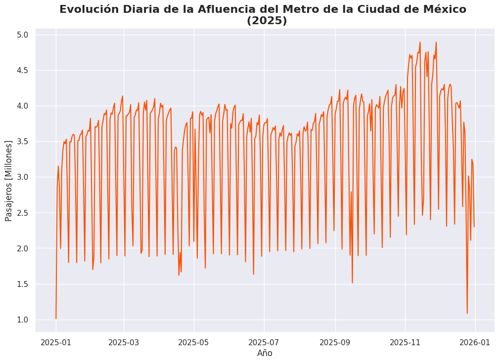 

### 3.2 Afluencia Total por Línea en 2025
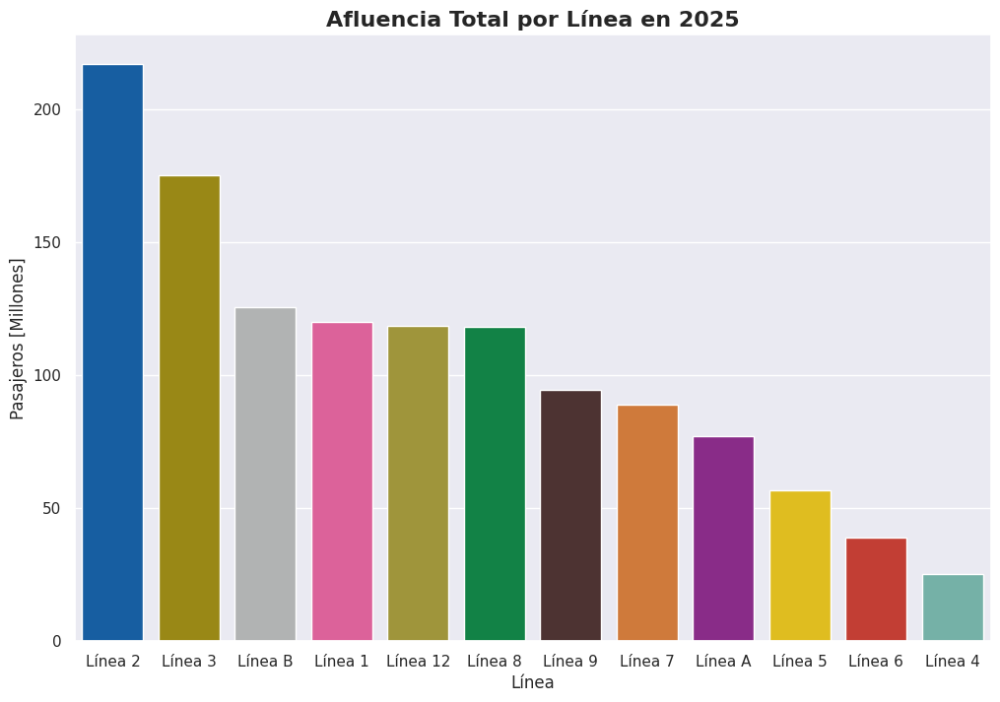
### 3.3 Promedio de Afluencia en 2025 (Línea x Día de la Semana)
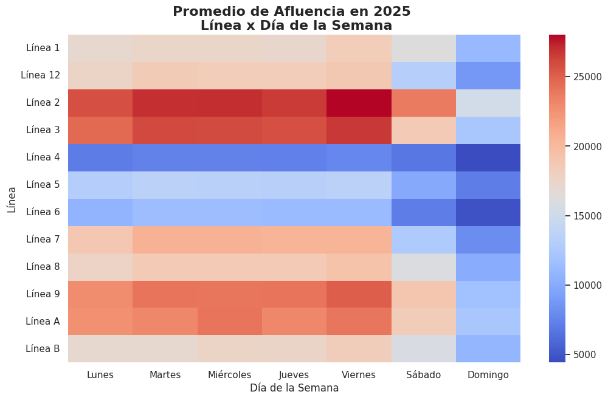
### 3.4 Distribución de la Afluencia por Día de la Semana
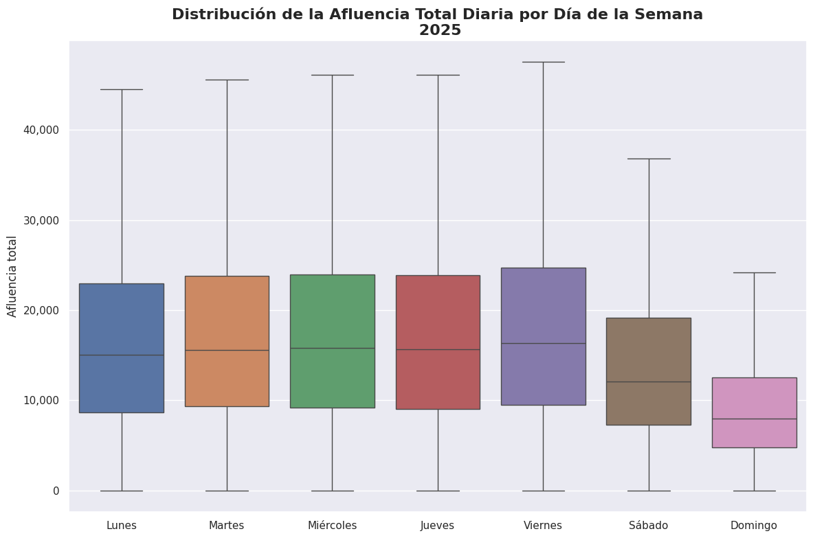
### 3.5 Afluencia por Línea en 2025
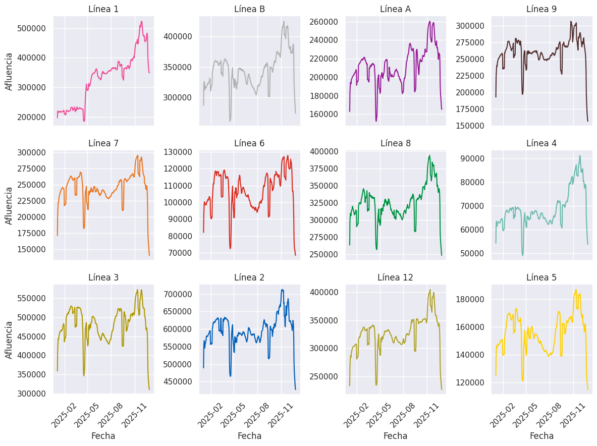
### 3.6 Variabilidad entre Semana por Línea en 2025
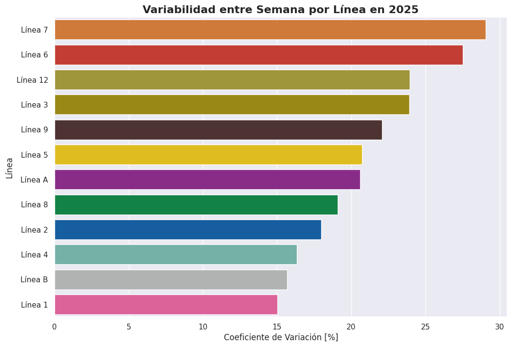 
### 3.7 Variabilidad por Línea en 2025 (Mensual)
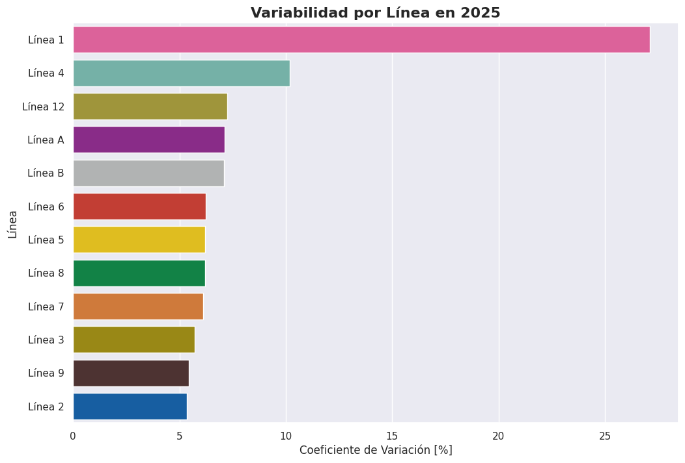
### 3.8 Perfil Semanal en 2025
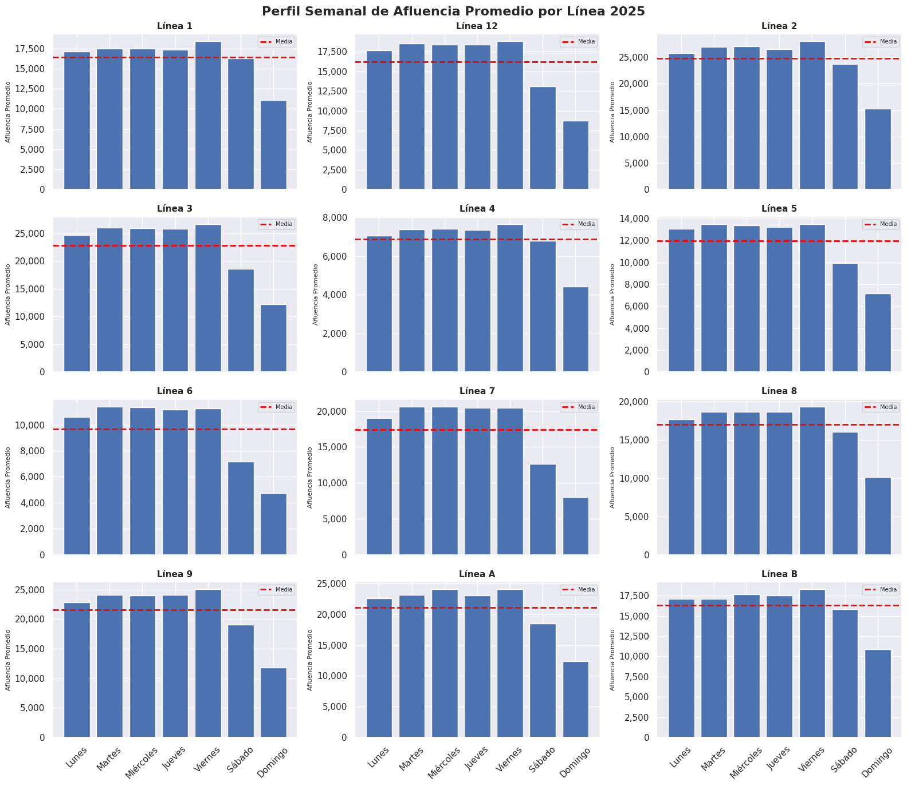 
### 3.9 Correlación entre Líneas
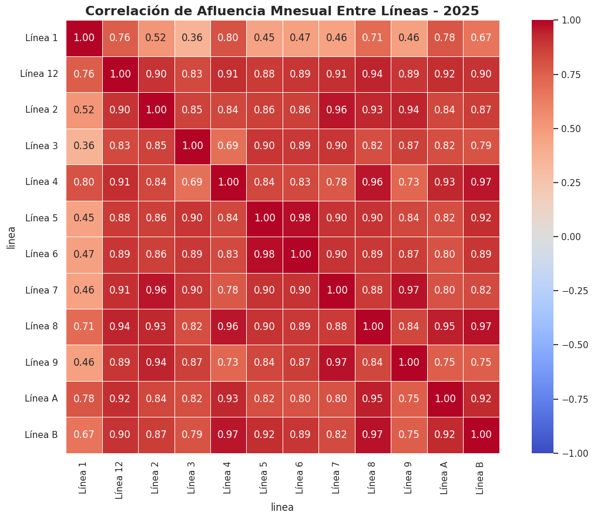 
### 3.10 Estaciones con Mayor Afluencia
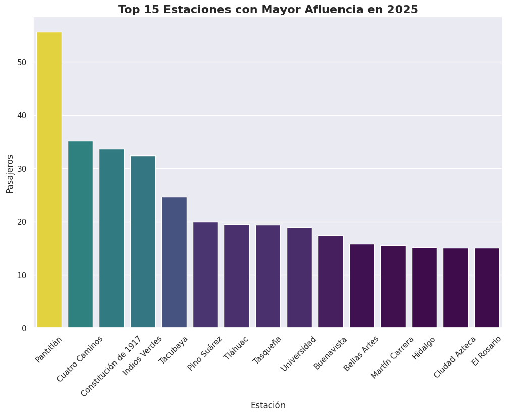 
### 3.11 Distribución total anual por estación
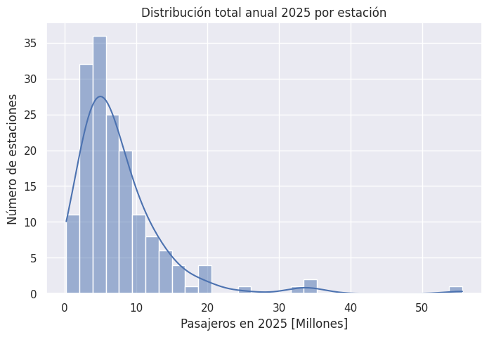 
### 3.12 Ranking Mensual de Estaciones 
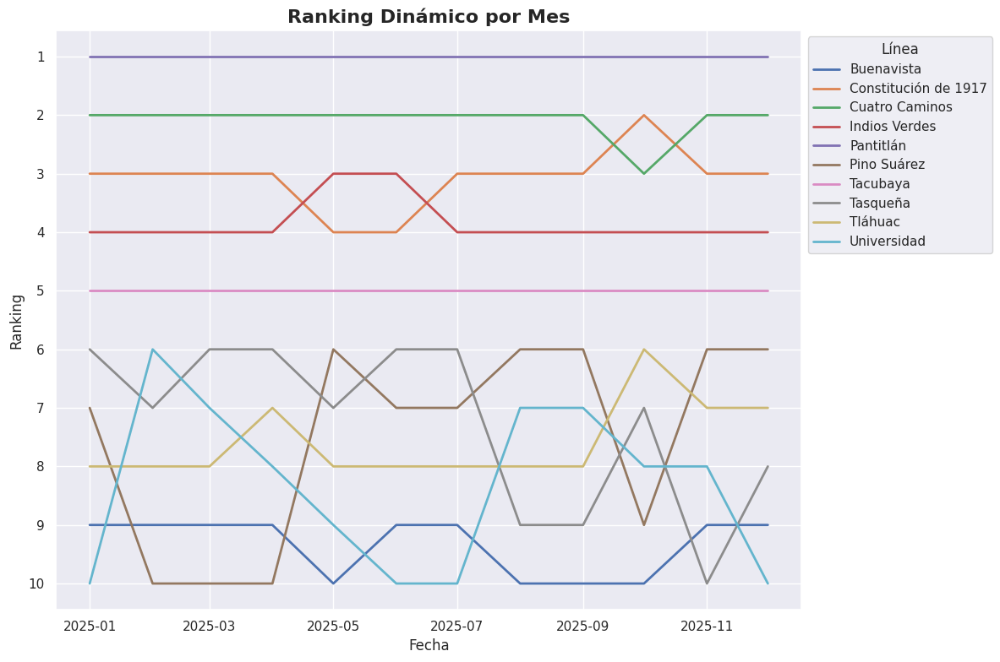 

## 4. Hallazgos Generales
- Las líneas más utilizadas durante el año de 2025 fueron:
  1. Línea 2
  2. Línea 3
  3. Línea B
  4. Línea 1
  5. Línea 12
- La afluencia presenta un comportamiento similar de lunes a viernes, cayendo en sábado y teniendo muy poca afluencia en domingo.
- La Línea 2, 3 9 y A tienen en promedio más de 25,000 pasajeros entre semana y en los fines de semana cae la afluencia.
- La línea 7 tiene entre semana una variabilidad cercana al 30% respecto a su promedio de afluencia, seguida por la línea 6, 12, 3 y 9. La línea con menor variabilidad entre semana fue la línea 1.
- A lo largo de los meses de 2025, la Línea 1 presento una variabilidad mayor del 25% respecto a su promedio. Las líneas restantes presentaron una variabilidad menor del 10%. La línea que fue más constante respecto a su promedio fue la línea 2.
- Las estaciones con mayor afluencia son:
  1. Pantitlán
  2. Cuatro Caminos
  3. Constitución de 1917
  4. Indios Verdes
  5. Tacubaya
## 5. Conclusiones
- El comportamiento de la afluencia del metro de la Ciudad de México se puede representar de manera gráfica y de diversas maneras.
- El comportamiento de la línea 1 es irregular, en comparación a la tendencia histórica, debido a la remodelación de la línea. 
## 6. Tecnologías utilizadas
- Python
- Pandas
- NumPy
- Matplotlib
- Seaborn
