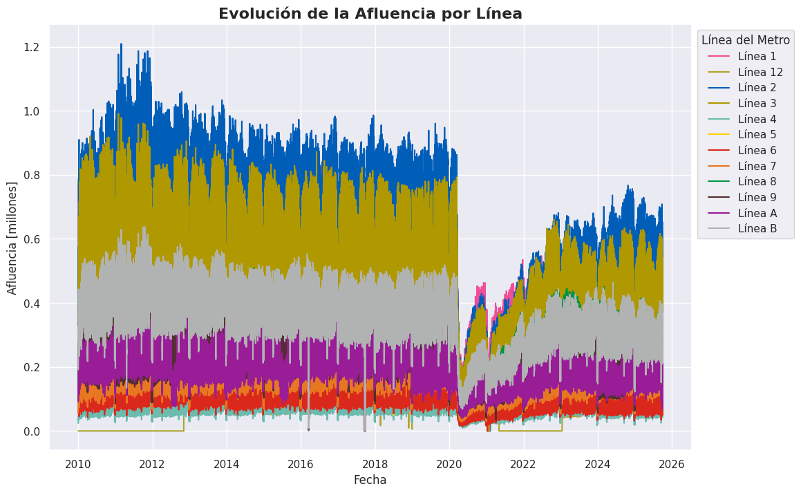
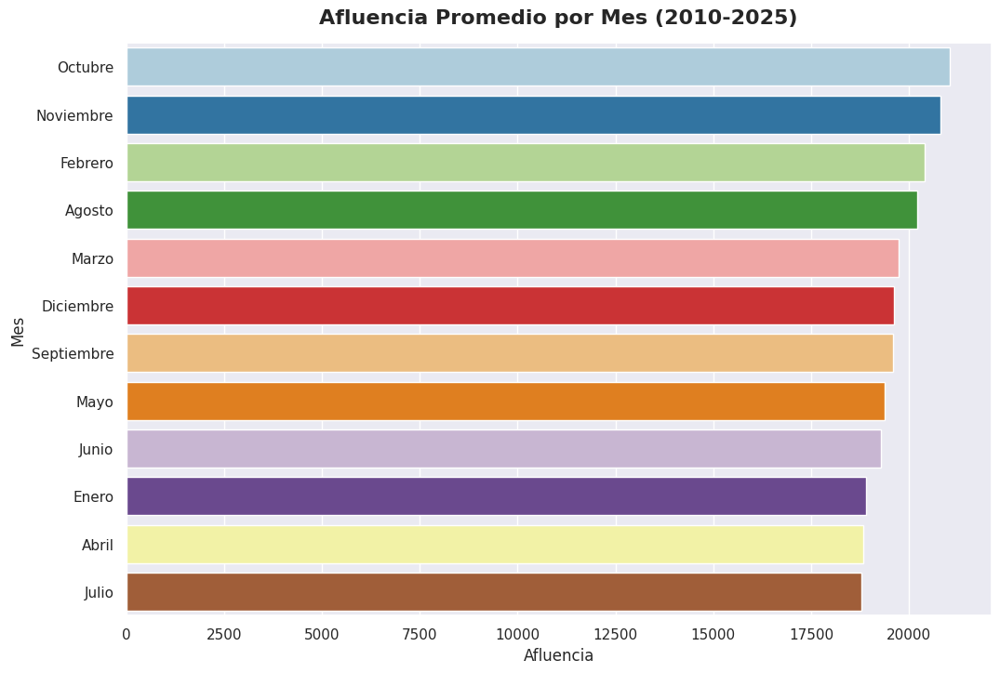
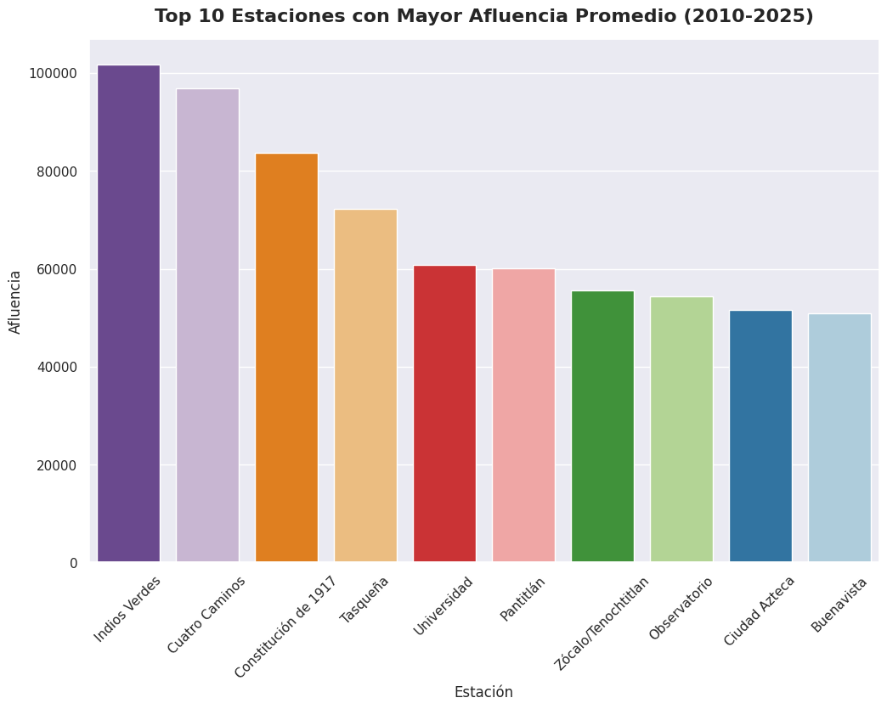
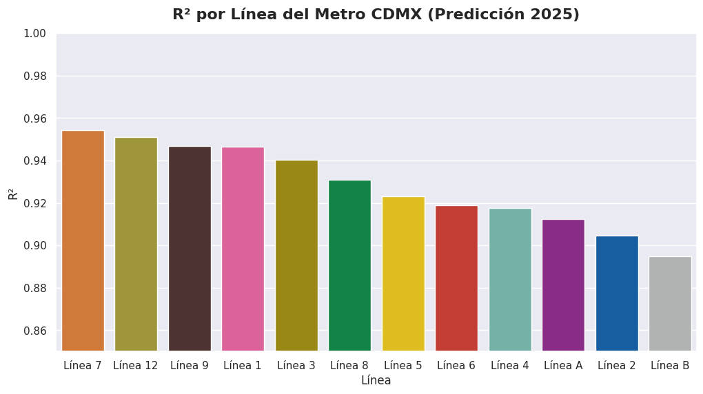
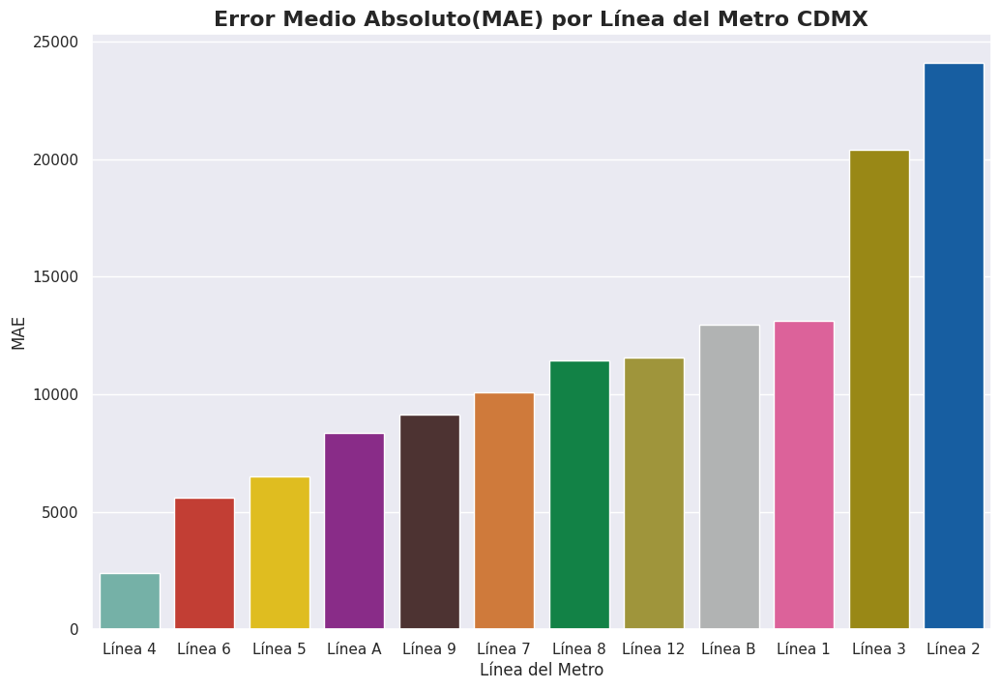
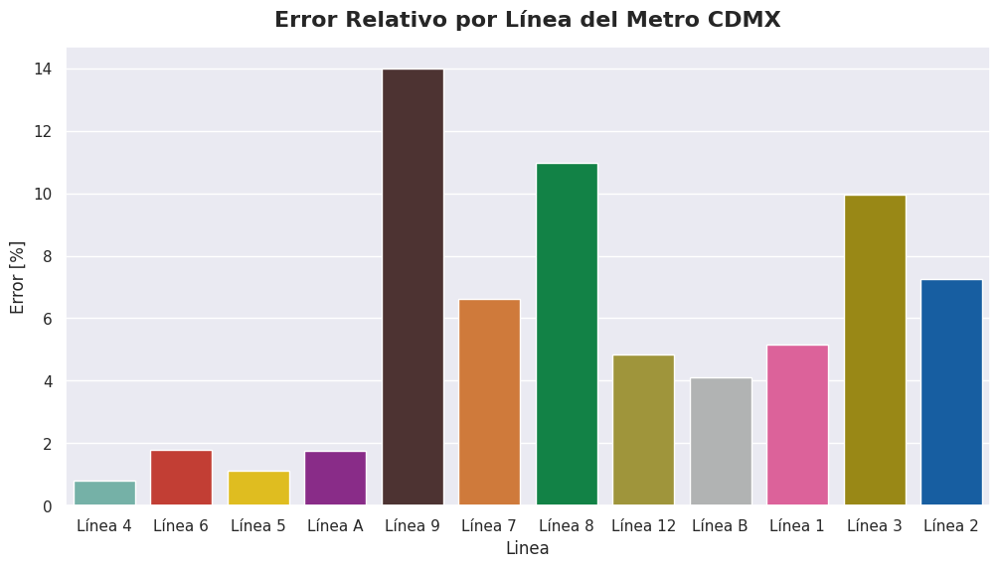
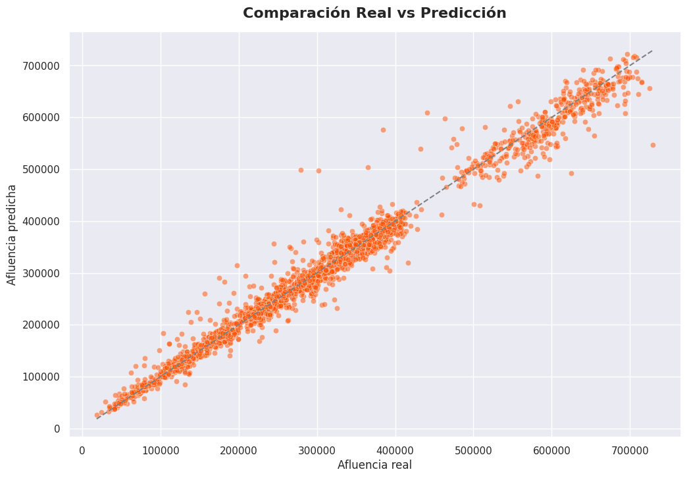

# Predicción de Afluencia del Metro de la Ciudad de México (2010-2025)
Este proyecto desarrolla un Modelo de Machine Learning capaz de predecir la **afluencia diaria del Metro de la Ciudad de México** por línea, utilizando datos históricos publicados en la plataforma de [Portal de Datos Abiertos](https://datos.cdmx.gob.mx/) del Gobierno de la Ciudad de México.

Incluye análisis exploratorio, ingeniería de características, prueba de varios modelos y una comparación del desempeño final para el año de 2025.

## 1. Estructura del Repositorio

|Archivo|Descripción|
|---|---|
|```visualizations```|Carpeta con las visualizaciones exportadas (png)|
|```Afluencia_Diaria_MetroCDMX.zip```| Datos originales sin limpiar|
|```Prediccion_Metro_CDMX.ipynb```| Notebook en donde se elaboró el análisis, modelo y visualizaciones|
|```README.md```|Descripción del Proyecto|

## 2. Dataset 
- **Fuente:** Portal de Datos Abiertos de la Ciudad de México
- **Periodo analizado:** 2010-2025
- **Tamaño del dataset**: 55.6 MB

**Variables principales**
|Variable|Descripción|
|---|---|
|```fecha```|Fecha del Registro|
|```anio```,```mes```| Componentes Temporales|
|```linea```| Línea del Metro|
|```estacion```|Estación del Metro|
|```afluencia```|Total de usuarios por día|

## 3. Objetivo del Proyecto
- Predecir la **afluencia diarioa por línea del Metro de la Ciudad de México**.
- Comparar resultados reales vs predichos para 2025.
- Identificar líneas con mayor/menor precisión.
- Evaluar el desempeño global del modelo.

## 4. Limpieza y Preprocesamiento
- Convertir ```fecha``` a ```datetime```.
- Correción de nombres de líneas y estaciones.
- Cálculo de componentes temporales.
- Detección de días feriados.
- Eliminación de duplicados y registros corruptos.

## 5. Análisis Exploratorio (EDA)
Este análisis incluye:
- Tendencia de afluencia por año
- Comparación entre líneas
- Distribución por mes y día
- Estaciones o líneas más transitadas
- Heatmap de afluencia por mes
- Top 10 de Estaciones con Mayor Afluencia Total
- Top 10 de Estaciones con Mayor Afluencia Promedio

  






## 6. Ingeniería de Características 

### Variables Temporales 
- Año, mes, día
- Número de día del año
- Día de la semana
- Indicador de fin de semana
- Indicador de feriado oficial

### Variables cíclicas
- Transformaciones seno/coseno para capturar periodicidad:
- ```mes_sin```,```mes_cos```
- ```dia_semana_sin```,```dia_semana__cos```

### Lag Features
- ```lag1```
- ```lag7```
- ```lag14```
- ```lag28```

### Rolling Windoes
- ```rolling7```
- ```rolling14```
- ```rolling30```
### One-hot Encoding
Para cada línea del Metro se uso One-hot Enconding.

## 7. Modelos 
Para la elaboración de los modelos, es **importante** mencionar que se utilizaron los datos de **2010 a 2024** como **entrenamiento**, mientras que los de **2025** se usaron como **prueba**, esto para evaluar el desempeño del modelo al momento de hacer predicciones. 

### Modelo Base (sin Lag Features)
Este primer modelo se elaboró sin ingeniería temporal avanzada. Para obtener predicciones se uso **XGBRegressor**. 
Las variables predictoras que se utilizaron fueron:
|**Variables Predictoras**| **Descripción**
|---|---|
| ```Anio```,```mes```,```dia```,```dia_semana```,```es_fin_de_semana```| Componentes temporales de la fecha del registro|
|```Línea 1```,```Línea 2```,...,```Línea 12```| One-Hot Encoding de las líneas del Sistema del Metro de la Ciudad de México|

La variable objetivo fue ```afluencia```.

#### Resultados

### Modelo Final: Modelo Final XGB

Se volvió a usar **XGBRegressor**, en este caso, se usaron las variables cíclicas, lag features y rolling windows. 

Las variables predictoras fueron: 

|**Variables Predictoras**| **Descripción**
|---|---|
| ```Anio```,```mes```,```dia```,```dia_semana```,```es_fin_de_semana```| Componentes temporales de la fecha del registro|
|```Línea 1```,```Línea 2```,...,```Línea 12```| One-Hot Encoding de las líneas del Sistema del Metro de la Ciudad de México|
| ```Anio```,```mes```,```dia```,```dia_semana```,```es_fin_de_semana```| Componentes temporales de la fecha del registro|
|```mes_sin```,```mes_cos```,```dia_semana_sin```,```dia_semana_cos```| Son variables que se repiten en ciclos, como mes, día de la semana o día del año.|
|```lag1```,```lag7```,```lag14```,```lag28```|Afluencia del día anterior, Afluencia de una semana antes, Afluencia de dos semanas antes, Afluencia de cuatro semanas antes, respectivamente|
|```rolling7```,```rolling14```,```rolling30```| Promedio de los últimos 7 días, Promedio de los últimos 14 días, Promedio de los últimos 30 días, respectivamente.|

**Hiperparámetros principales**:
- ```n_estimators```= 500
- ```max_depth```= 6
- ```learning_rate```= 0.05
- ```subsample```=0.8
- ```colsample_bytree```=0.8
- ```objective```='reg:squarederror'
- ```random_state```=42

Las **predicciones** se hicieron en escala ```log1p```. 

#### Resultados 
**Métricas globales** para predicciones de afluencia para 2025
- **MAE**: 11309.11
- **RMSE**: 375679584.00
- **R²** : 0.985









## 8. Conclusiones
- El modelo logra una **alta precisión** en la mayoría de las líneas.
- Los **lag features y variables cíclicas** fueron claves para alcanzar un desempeño alto.
- Algúnas líneas presentan más variabilidad, como la Línea 1 y 2, las cuales son las que cuentan con más afluencia.
- Los feriados y fines de semana aportan información valiosa

## 9. Limitaciones
- En el modelo no se toman en cuenta los datos por estación, solo por línea.
- No se consideran fallas operativas, cierres o eventos extraordinarios. Solamente en el caso de la Línea 12 se toma en cuenta el tiempo de construcción y el cierro que se tuvo por accidente y trabajos de correcciones.
- Los datos dependen totalmente de reportes oficiales.

## 10. Trabajo Futuro
- Predicción por estación.
- Series de tiempo con LSTM/Transformers.
- Dashboard Interactivo.
- Detección de anomalís en días atípicos.

## 11. Tecnologías Utilizadas
- **Python**:
  - ```pandas```
  - ```matplotlib```
  - ```seaborn```
  - ```numpy```
  - ```sklearn```
  - ```holidays```
- **Jupyter Notebooks** para desarrollo, modelaje, predicción y visualizaciones.

## Créditos:
- **Autor**: [Andrés Guzmán Rodríguez](https://github.com/AndrsGzRo)
- **Fuente**: [Afluencia Diaria del Metro (Desglosada) - Portal de Datos Abiertos del Gobierno de la Ciudad de México](https://datos.cdmx.gob.mx/dataset/afluencia-diaria-del-metro-cdmx/resource/cce544e1-dc6b-42b4-bc27-0d8e6eb3ed72)
