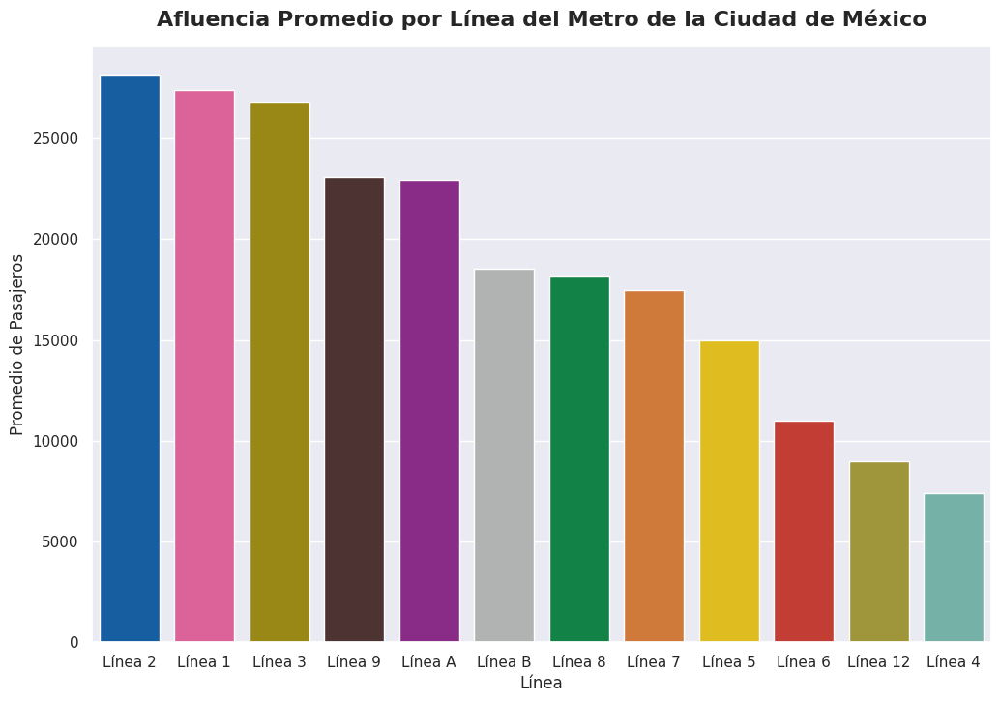
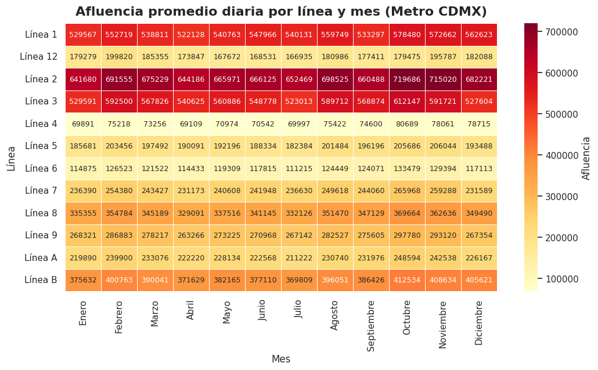

# Predicción de Afluencia del Metro de la Ciudad de México (2010-2025)
Este proyecto desarrolla un Modelo de Machine Learning capaz de predecir la **afluencia diaria del Metro de la Ciudad de México** por línea, utilizando datos históricos publicados en la plataforma de [Portal de Datos Abiertos](https://datos.cdmx.gob.mx/) del Gobierno de la Ciudad de México.

Incluye análisis exploratorio, ingeniería de características, prueba de varios modelos y una comparación del desempeño final para el año de 2025.

## 1. Estructura del Repositorio


## 2. Dataset 
- **Fuente:** Portal de Datos Abiertos de la Ciudad de México
- **Periodo analizado:** 2010-2025
- **Tamaño del dataset**: 55.6 MB

**Variables principales**
|Variable|Descripción|
|---|---|
|```fecha```|Fecha del Registro|
|```anio```,```mes```| Componentes Temporales|
|```linea```| Línea del Metro|
|```estacion```|Estación del Metro|
|```afluencia```|Total de usuarios por día|

## 3. Objetivo del Proyecto
- Predecir la **afluencia diarioa por línea del Metro de la Ciudad de México**.
- Comparar resultados reales vs predichos para 2025.
- Identificar líneas con mayor/menor precisión.
- Evaluar el desempeño global del modelo.

## 4. Limpieza y Preprocesamiento
- Convertir ```fecha``` a ```datetime```.
- Correción de nombres de líneas y estaciones.
- Cálculo de componentes temporales.
- Detección de días feriados.
- Eliminación de duplicados y registros corruptos.

## 5. Análisis Exploratorio (EDA)
Este análisis incluye:
- Tendencia de afluencia por año
- Comparación entre líneas
- Distribución por mes y día
- Estaciones o líneas más transitadas
- Teatmap de afluencia por mes



