# Predicción de Afluencia del Metro de la Ciudad de México para 2026
Este proyecto desarrolla un Modelo de Machine Learning capaz de predecir la **afluencia diaria del Metro de la Ciudad de México en el año de 2026** por línea, utilizando datos históricos publicados en la plataforma de [Portal de Datos Abiertos](https://datos.cdmx.gob.mx/) del Gobierno de la Ciudad de México.

Incluye análisis exploratorio, ingeniería de características, prueba de varios modelos y una comparación del desempeño final para el año de 2025.

## Estructura del Repositorio

|Archivo|Descripción|
|---|---|
|```Analysis_2025```|Análisis de la Afluencia del Metro de la Ciudad de México en 2025. Incluye README conv visualizaciones|
|```Data```|Carpeta con los datos sin procesar y procesados|
|```Visualizaciones```|Visualizaciones de los modelos de machine learning en png. |
|```notebooks```| Carpeta donde se encuentran los notebooks para la construcción y actualización de los dataframes de afluencia. Así mismo, el EDA del análisis de 2010 a 2025 y el análisis de 2025. |
|```Prediccion_Metro_CDMX.ipynb```|Notebook donde se elaboró el modelo de ML y visualizaciones|
|```README.md```|Descripción del Proyecto|

## . Dataset 
- **Fuente:** Portal de Datos Abiertos de la Ciudad de México
- **Periodo analizado:** 2010-2025
- **Tamaño del dataset**: 55.6 MB

**Variables principales**
|Variable|Descripción|
|---|---|
|```fecha```|Fecha del Registro|
|```anio```,```mes```| Componentes Temporales del Registro|
|```linea```| Línea del Metro|
|```estacion```|Estación del Metro|
|```mes_num```,```mes_nom```| Nombre y Mes del Registro|
|```afluencia```|Total de usuarios por día|

## Objetivo del Proyecto
- Predecir la **afluencia diaria por línea en 2026 del Metro de la Ciudad de México**.
- Comparar resultados reales vs predichos para 2025.
- Identificar líneas con mayor/menor precisión.
- Visualizar la afluencia predicha.
- Utilizar XGBoost para la predicción de afluencia.
- Prophet para calcular la demanda futura.
- Evaluar el desempeño global del modelo.

### Análisis Exploratorio (EDA)


 


## Modelo 1: XGBRegressor 

Se entrenó un modelo de gradient boostin, XGBoost, con 2000 árboles de decisión de profundidad máxima 5. Para controlar el sobreajuste se utilizó una tasa de aprendizaje de 0.05, un submuestreo de 90% de los datos y del 80%de las variables en cada árbol. El entrenamiento de este modelo se detuvo automáticamente si este dejaba de mejorar en validación por 50 iteraciones consecutivas. 
### Ingeniería de Características
####  Variables Temporales 
- Año, mes, día
- Número de día del año
- Día de la semana
- Indicador de fin de semana
### Conjuntos de Entrenamiento, Validación y Prueba
- Los datos a utilizar para el set de entrenamiento son los datos de afluencia de 2010 a 2023.
- El set de validación abarca la afluencia de 2024.
- El set de prueba utiliza únicamente la afluencia de 2025.

### OneHotEnconder 
El uso de OneHotEncoder radica para convertir la columna ```linea```, la cual contiene texto como "Linea 1", "Linea 2", a columnas numéricas para que XGBoost pueda entender los datos.

El resultado de utilizar OneHotEncoder es una columna binaria por cada línea, por ejemplo, si un registro pertenece a la Línea 1, la columna ```linea_Linea 1``` tendría un valor de 1 y todas las demás tendrán el valor de 0. 
```
linea      →    linea_Línea 1    linea_Línea 2    linea_Línea 3  ...
Línea 1    →         1                0                0
Línea 2    →         0                1                0
Línea 3    →         0                0                1
```

### Variables Predictoras
Las variables predictoras que se utilizaron fueron:
|**Variables Predictoras**| **Descripción**
|---|---|
| ```Anio```,```mes```,```dia```,```dia_semana```,```es_fin_de_semana```| Componentes temporales de la fecha del registro|
|```Línea 1```,```Línea 2```,...,```Línea 12```| One-Hot Encoding de las líneas del Sistema del Metro de la Ciudad de México|

### Variable Objetivo
La variable objetivo es ```afluencia```. 

### Desempeño 
| Set | MAE | RMSE | R² |
|-----|-----|------|----|
|Validación|37659.35| 59496.90|0.861|
|Test|49890.53|82505.92|0.743|

#### Visualizaciones


## Modelo 2: XGRegressor + Lag Features, Rolling Windows, Vacaciones
### Lag Features
- ```lag1```
- ```lag7```
- ```lag14```
- ```lag28```

### Rolling Windoes
- ```rolling7```
- ```rolling14```
- ```rolling30```

### Variables cíclicas
- Transformaciones seno/coseno para capturar periodicidad:
- ```mes_sin```,```mes_cos```
- ```dia_semana_sin```,```dia_semana__cos```
- ```dia_sin```,```dia_cos```

|**Variables Predictoras**| **Descripción**|
|---|---|
| ```Anio```,```mes```,```dia```,```dia_semana```,```es_fin_de_semana```| Componentes temporales de la fecha del registro|
|```Línea 1```,```Línea 2```,...,```Línea 12```| One-Hot Encoding de las líneas del Sistema del Metro de la Ciudad de México|
| ```Anio```,```mes```,```dia```,```dia_semana```,```es_fin_de_semana```| Componentes temporales de la fecha del registro|
|```mes_sin```,```mes_cos```,```dia_semana_sin```,```dia_semana_cos```,```dia_sin```,```dia_cos```| Son variables que se repiten en ciclos, como mes, día de la semana o día del año.|
|```lag1```,```lag7```,```lag14```,```lag28```|Afluencia del día anterior, Afluencia de una semana antes, Afluencia de dos semanas antes, Afluencia de cuatro semanas antes, respectivamente|
|```rolling7```,```rolling14```,```rolling30```| Promedio de los últimos 7 días, Promedio de los últimos 14 días, Promedio de los últimos 30 días, respectivamente.|

**Hiperparámetros principales**:
- ```n_estimators```= 2000
- ```max_depth```= 5
- ```learning_rate```= 0.05
- ```subsample```=0.9
- ```colsample_bytree```=0.8
- ```min_child_weight``` = 10
- ```early_stopping_rounds``` = 50
- ```random_state```=42

La variable objetivo sigue siendo ```afluencia```

### Desempeño 
| Set | MAE | RMSE | R² |
|-----|-----|------|----|
|Validación|20767.46| 59496.90|0.983|
|Test|13382.40|22644.21|0.981|

### Visualizaciones
#### Feature Importance
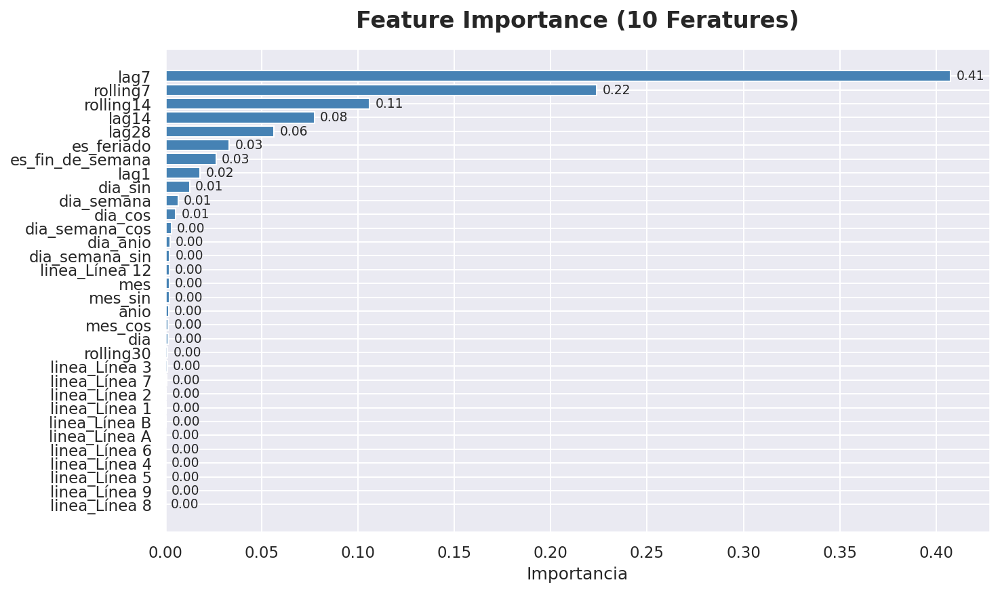 

Interpretación: 
- **lag7(0.41):** La afluencia de hace 7 días, mismo día de la semana anterior, es el mejor predictor para la afluencia actual. Por lo tanto, el patrón semanal es el más fuerte en este caso.
- **rolling7 (0.22):** El promedio de los últimos 7 días aporta contexto sobre la demanda. Junto con lag7 explica el 63% de la importancia total del modelo.
- **rolling 14 (0.11):** El promedio de las últimas dos semanas captura tendencias de más largo plazo, útil para detectar si la demanda está subiendo o bajando.
- **lag14 (0.08):** La alfuencia de hace dos semanas refuerza el patrón quincenal, relevante en pagos de quincena.
- **lag 28 (0.06)**: La afluencia de hace 28 días aproxima el mismo día del mes anterior, capturando patrones mensuales de movilidad.

#### Error Porcentual por Línea
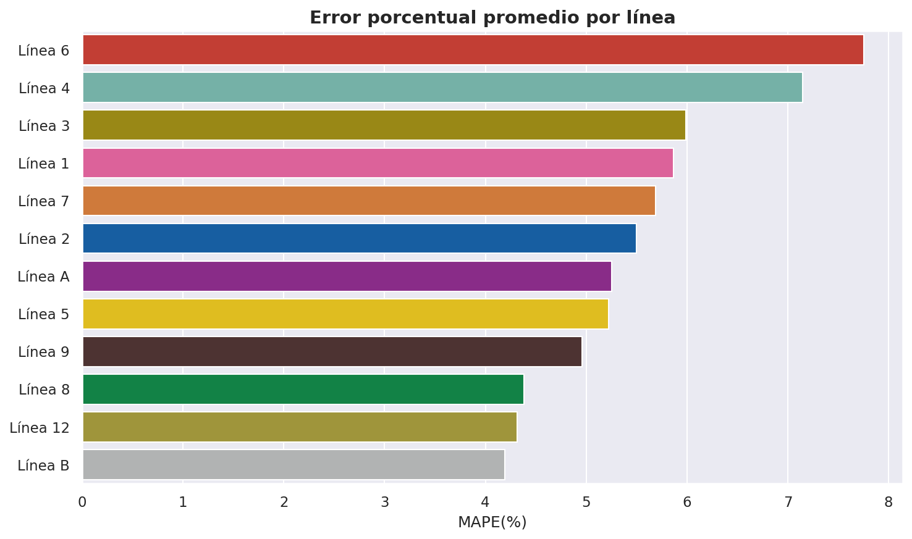

#### $R^{2}$ por Línea
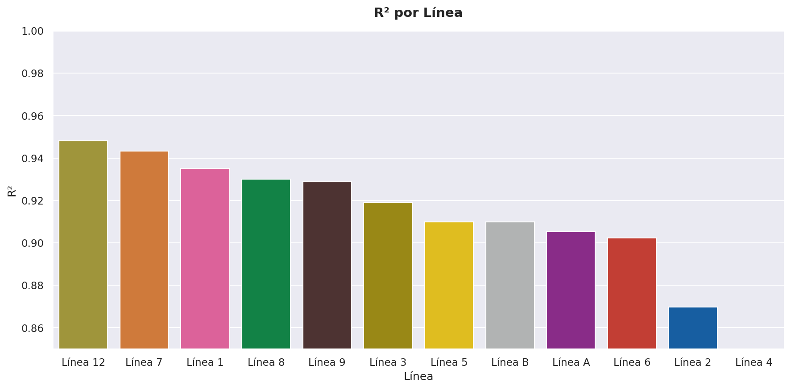 

#### Afluencia Real vs Predicha Serie de Tiempo (2025)
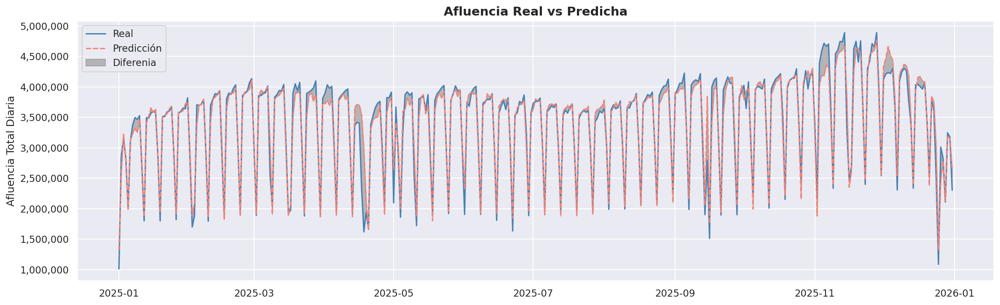

#### Afluencia Real vs Afluencia Predicha
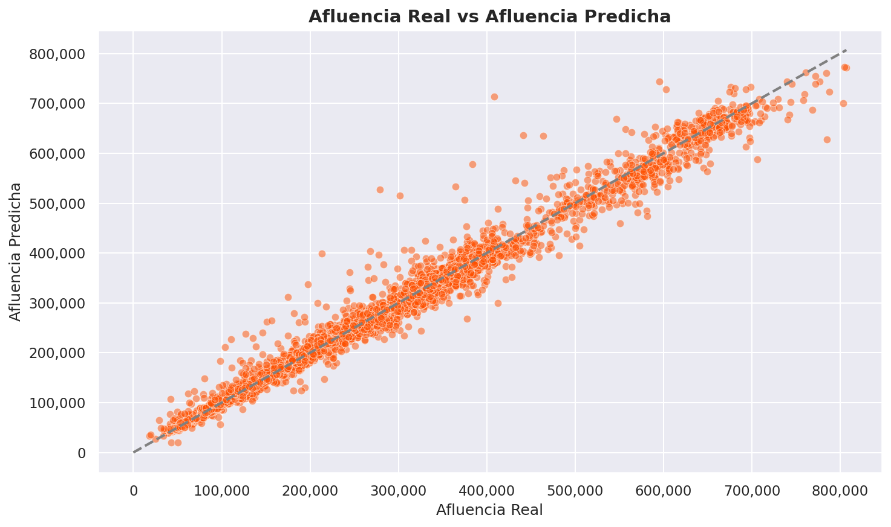

#### Afluencia Predicha en 2026 
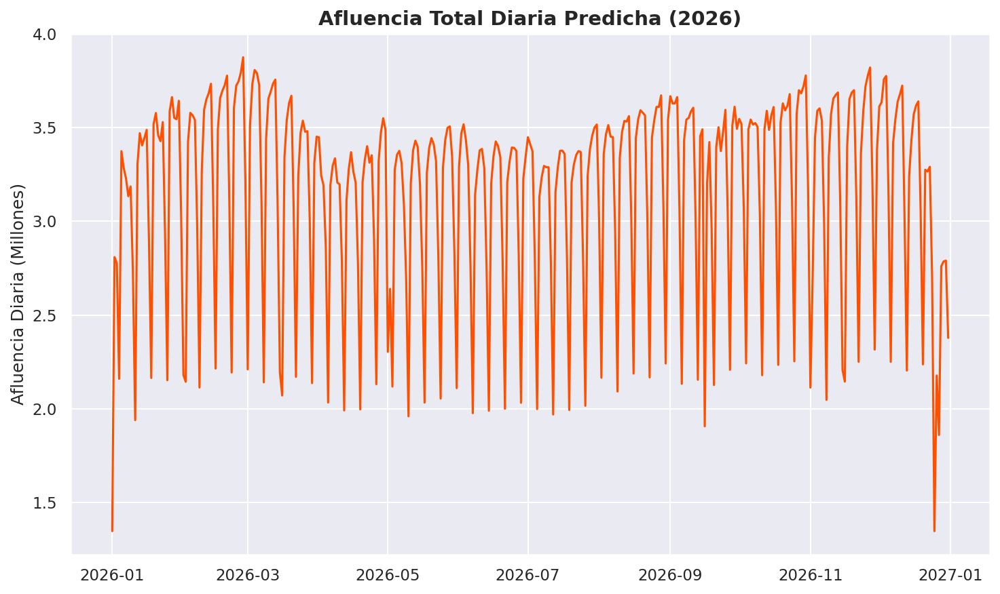 

#### Afluencia Total por Línea en 2026
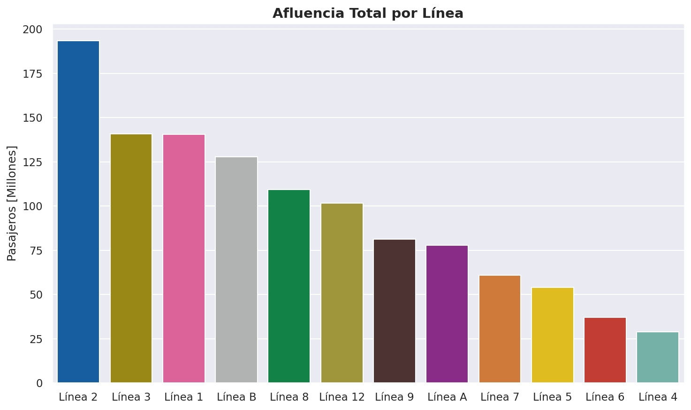 


#### Afluencia Mensual por Línea en 2026
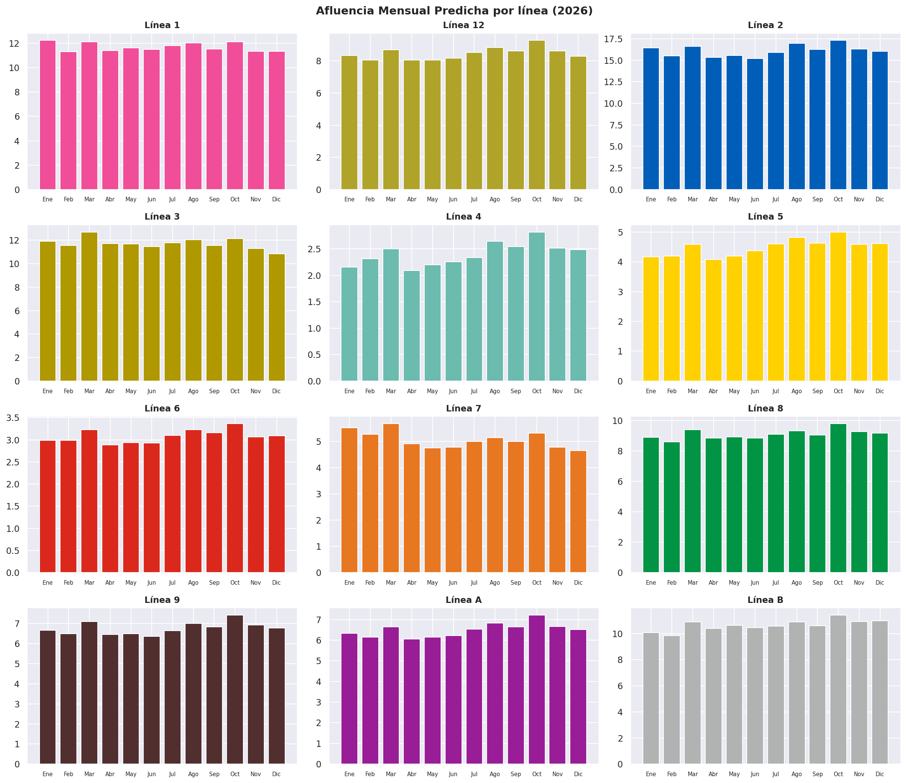 

## Modelo Prophet + XGBoost
Para mejorar las predicciones de afluencia para 2026 se utilizó Prophet de Meta. Esta está diseñada para predecir series de tiempo. A diferencia de XGBoost, Prophet permite obtener predicciones e **intervalos de confianza** del 95% para cada una de las 12 líneas durante 2026. Este es una de las principales ventajas de Prophet, ya que en lugar de dar una predicción puntual, se obtiene un rango probable de demanda para cada mes.  
Así mismo, se utilizaron las predicciones de XGBoost como variable adicional dentro de Prophet. 

### Visualizaciones
#### Predicción de Afluencia para 2026
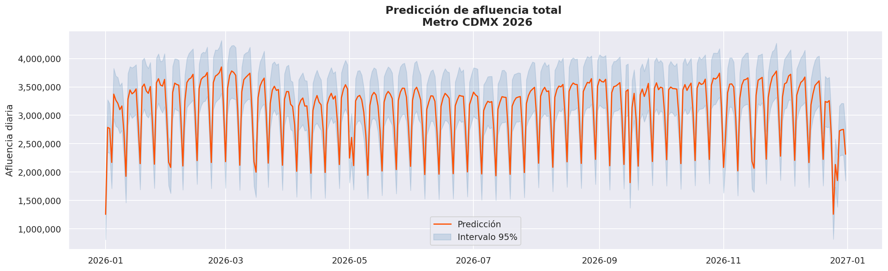

#### Afluencia Real 2025 vs Predicción 2026 
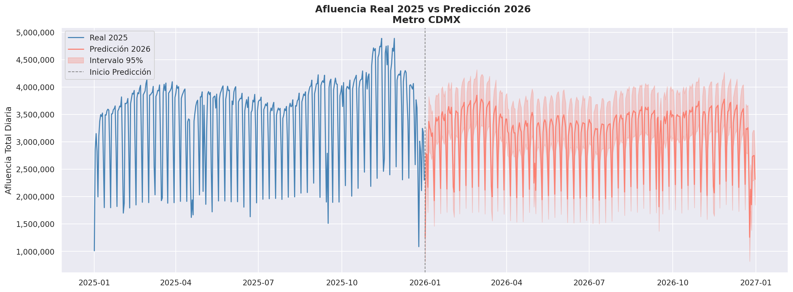

#### Predicción Afluencia Mensual
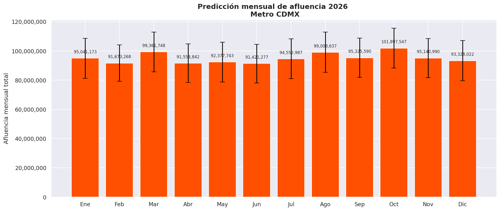

#### Afluencia Real 2025 vs Predicción 2026 por línea 
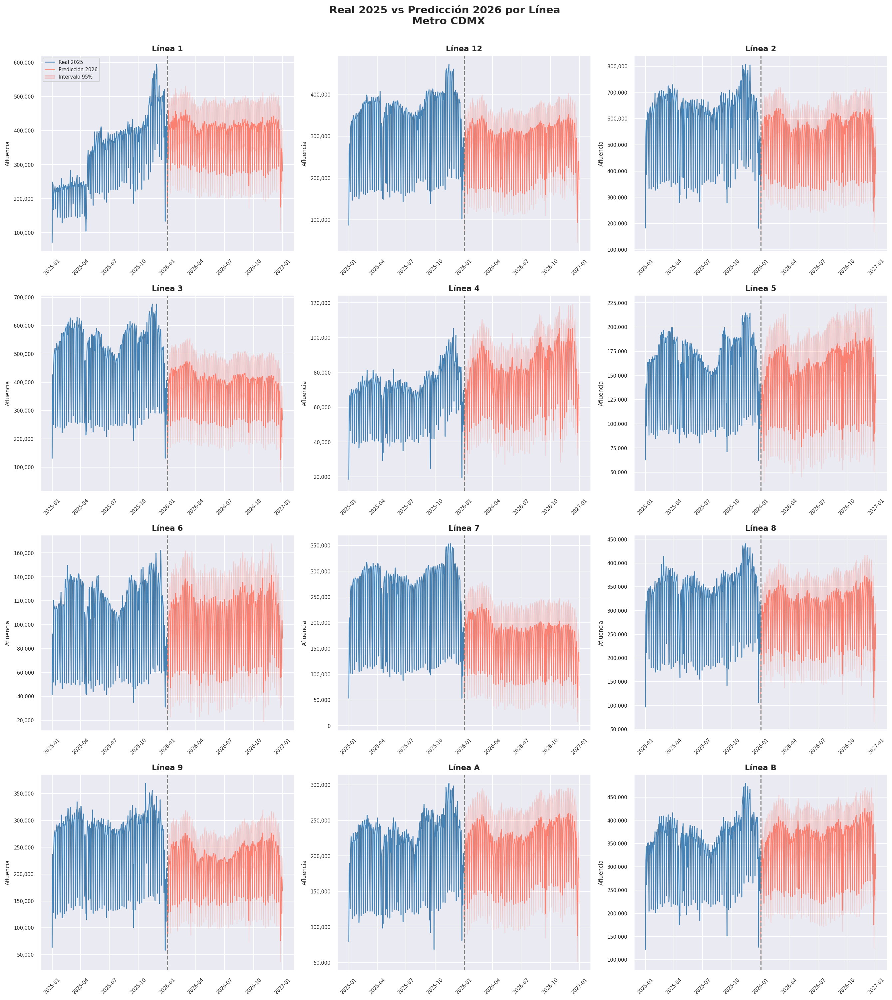 

#### Predicción Mensual en 2026 por Línea
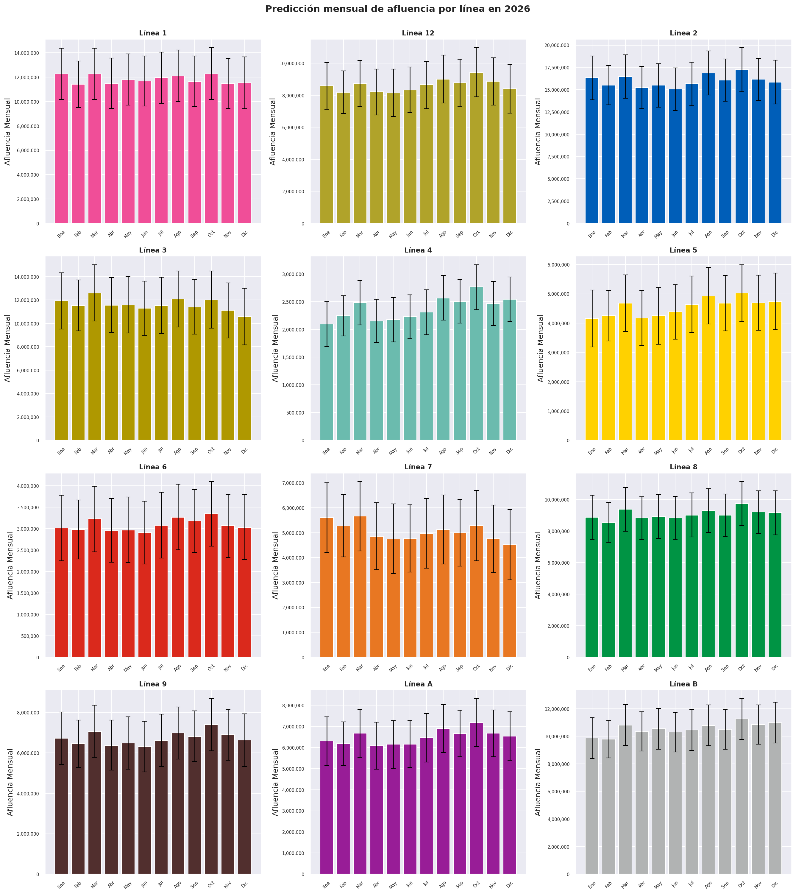 

## Comparación de Resultados
Se evaluaron los tres modelos obre el mismo periodo de prueba, midiendo el error absoluto medio (MAE), la raíz cuadrado del error cuadrático medio (RMSE) y el coeficiente de determinación ($R^{2}$). 
|Modelo           |MAE|RMSE| R²|
|-----------------|---|----|---|
|XGBoost + features| 121,562 |192,510|0.941|
|Prophet + XGBoost| 119,069 |190,716| 0.942 |}

## Conclusión
Gracias al modelado predictivo con XGBoost se descubrió que la afluencia depende mayoritariamente de sus propios valores pasados. La incorporación de lags y promedios móviles transformó un modelo de R² de 0.715 a uno de 0.982, siendo el lag de 7 días, la afluencia del mismo día de la semana anterior, la variable más importante para la predicción de afluencia. Esta cuenta con el 41% de la importancia total del modelo. 

Para los predicciones de 2026 se optó por el modelo Prophet + XGBoost, entrenado de forma independiente para cada una de las 12 líneas. Este modelo ofrece una ventaja fundamental para la planeación operativa: los intervalos de confianza al 95%. En lugar de predecir un único valor de demanda, el modelo entrega un rango probable de afluencia para cada mes y línea, reconociendo la incertidumbre a cualquier predicción de largo plazo. 
## Créditos:
- **Autor**: [Andrés Guzmán Rodríguez](https://github.com/AndrsGzRo)
- **Fuente**: [Afluencia Diaria del Metro (Desglosada) - Portal de Datos Abiertos del Gobierno de la Ciudad de México](https://datos.cdmx.gob.mx/dataset/afluencia-diaria-del-metro-cdmx/resource/cce544e1-dc6b-42b4-bc27-0d8e6eb3ed72)
