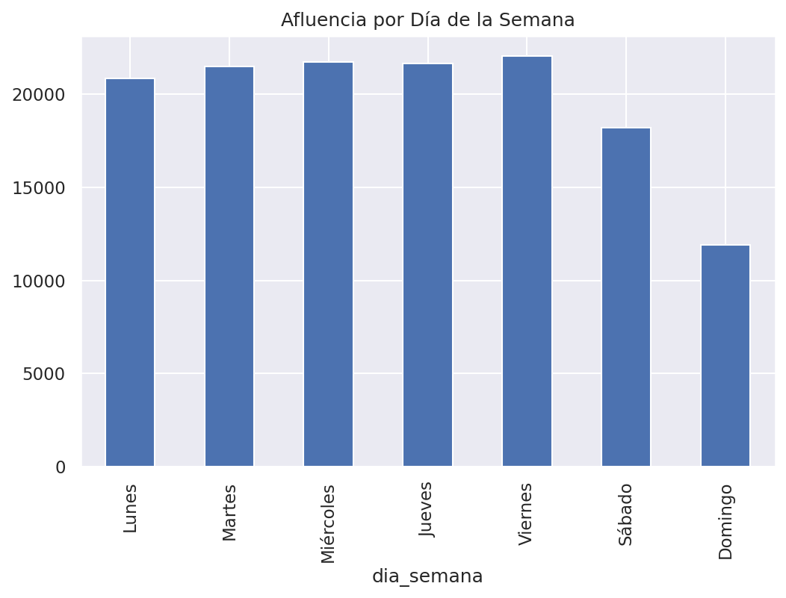
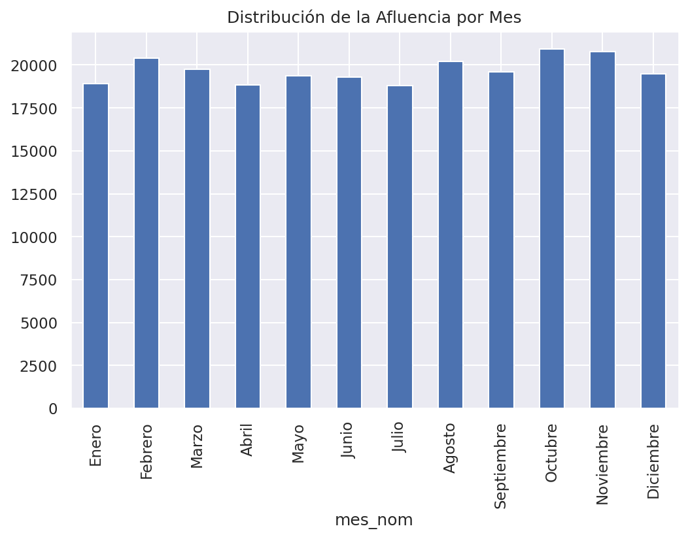
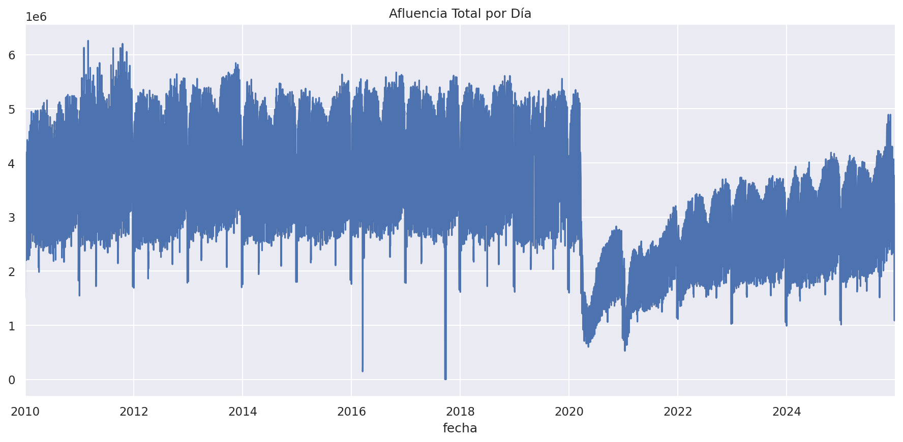
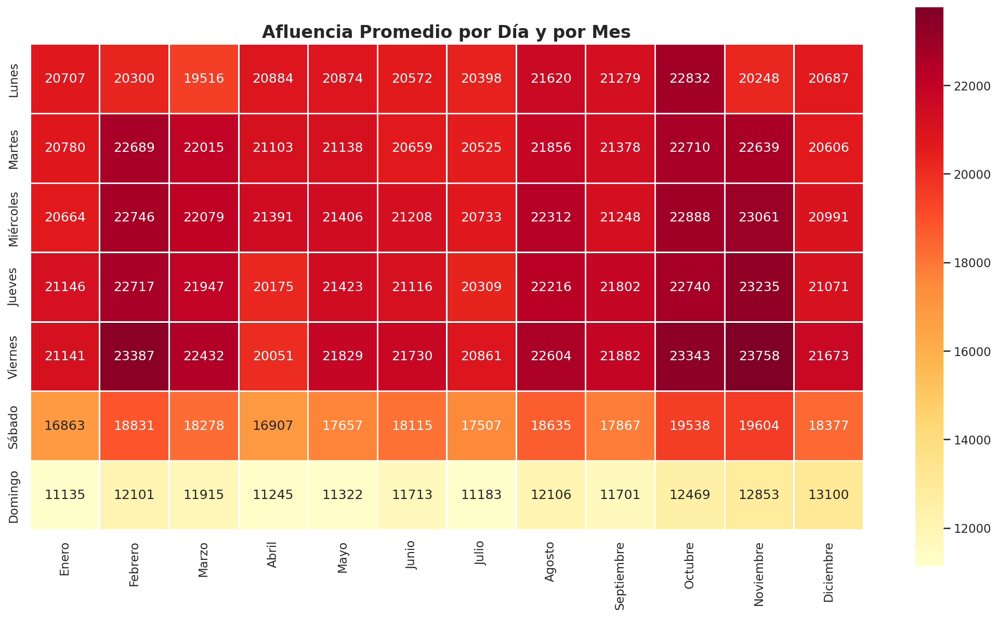
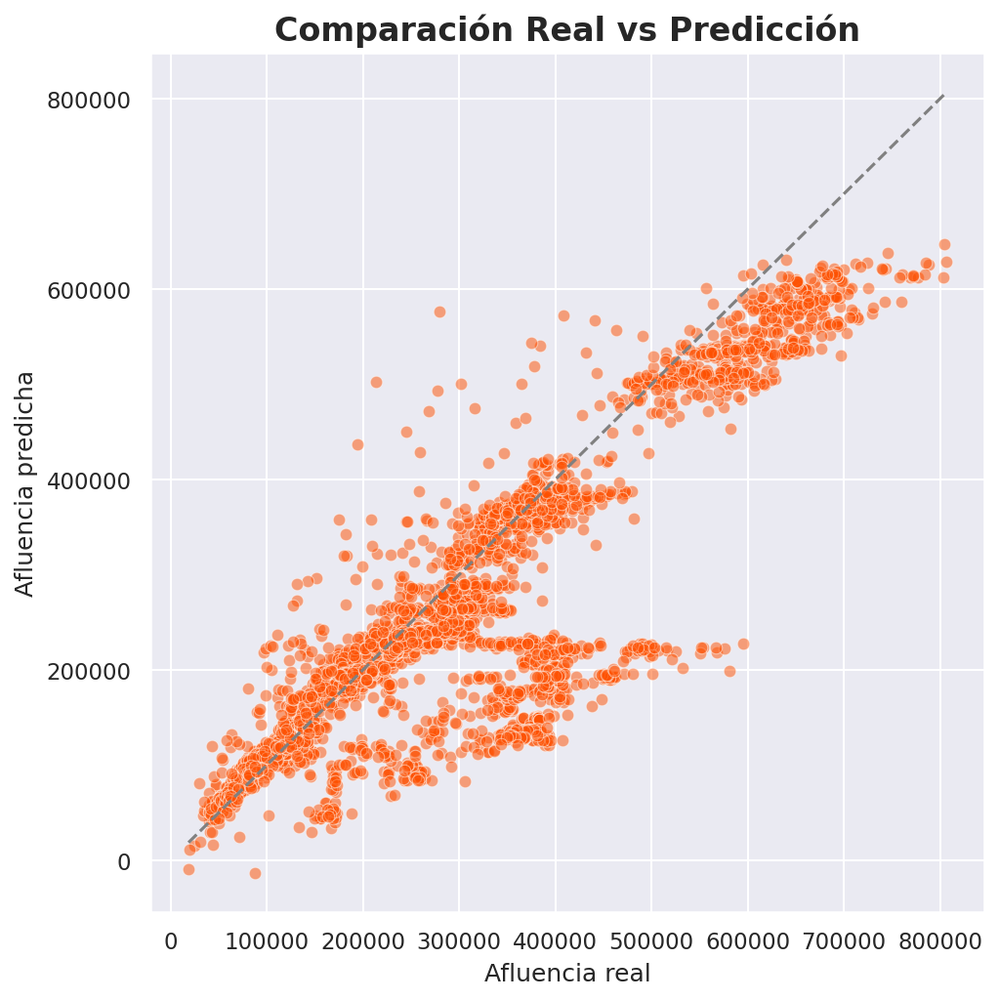
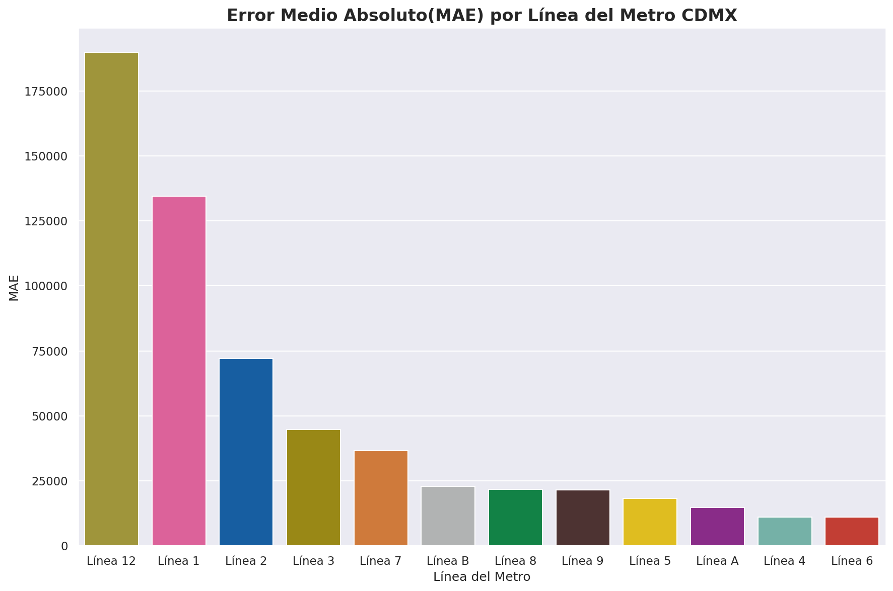

# Predicción de Afluencia del Metro de la Ciudad de México para 2026
Este proyecto desarrolla un Modelo de Machine Learning capaz de predecir la **afluencia diaria del Metro de la Ciudad de México en el año de 2026** por línea, utilizando datos históricos publicados en la plataforma de [Portal de Datos Abiertos](https://datos.cdmx.gob.mx/) del Gobierno de la Ciudad de México.

Incluye análisis exploratorio, ingeniería de características, prueba de varios modelos y una comparación del desempeño final para el año de 2025.

## Estructura del Repositorio

|Archivo|Descripción|
|---|---|
|```Analysis_2025```|Análisis de la Afluencia del Metro de la Ciudad de México en 2025. Incluye README conv visualizaciones|
|```Data```|Carpeta con los datos sin procesar y procesados|
|```Visualizaciones```|Visualizaciones de los modelos de machine learning en png. |
|```notebooks```| Carpeta donde se encuentran los notebooks para la construcción y actualización de los dataframes de afluencia. Así mismo, el EDA del análisis de 2010 a 2025 y el análisis de 2025. |
|```Prediccion_Metro_CDMX.ipynb```|Notebook donde se elaboró el modelo de ML y visualizaciones|
|```README.md```|Descripción del Proyecto|

## . Dataset 
- **Fuente:** Portal de Datos Abiertos de la Ciudad de México
- **Periodo analizado:** 2010-2025
- **Tamaño del dataset**: 55.6 MB

**Variables principales**
|Variable|Descripción|
|---|---|
|```fecha```|Fecha del Registro|
|```anio```,```mes```| Componentes Temporales del Registro|
|```linea```| Línea del Metro|
|```estacion```|Estación del Metro|
|```mes_num```,```mes_nom```| Nombre y Mes del Registro|
|```afluencia```|Total de usuarios por día|

## Objetivo del Proyecto
- Predecir la **afluencia diaria por línea en 2026 del Metro de la Ciudad de México**.
- Comparar resultados reales vs predichos para 2025.
- Identificar líneas con mayor/menor precisión.
- Visualizar la afluencia predicha.
- Utilizar XGBoost para la predicción de afluencia.
- Prophet para calcular la demanda futura.
- Evaluar el desempeño global del modelo.

### Análisis Exploratorio (EDA)


 


## Modelo 1: XGBRegressor 

Se entrenó un modelo de gradient boostin, XGBoost, con 2000 árboles de decisión de profundidad máxima 5. Para controlar el sobreajuste se utilizó una tasa de aprendizaje de 0.05, un submuestreo de 90% de los datos y del 80%de las variables en cada árbol. El entrenamiento de este modelo se detuvo automáticamente si este dejaba de mejorar en validación por 50 iteraciones consecutivas. 
### Ingeniería de Características
####  Variables Temporales 
- Año, mes, día
- Número de día del año
- Día de la semana
- Indicador de fin de semana
### Conjuntos de Entrenamiento, Validación y Prueba
- Los datos a utilizar para el set de entrenamiento son los datos de afluencia de 2010 a 2023.
- El set de validación abarca la afluencia de 2024.
- El set de prueba utiliza únicamente la afluencia de 2025.

### OneHotEnconder 
El uso de OneHotEncoder radica para convertir la columna ```linea```, la cual contiene texto como "Linea 1", "Linea 2", a columnas numéricas para que XGBoost pueda entender los datos.

El resultado de utilizar OneHotEncoder es una columna binaria por cada línea, por ejemplo, si un registro pertenece a la Línea 1, la columna ```linea_Linea 1``` tendría un valor de 1 y todas las demás tendrán el valor de 0. 
```
linea      →    linea_Línea 1    linea_Línea 2    linea_Línea 3  ...
Línea 1    →         1                0                0
Línea 2    →         0                1                0
Línea 3    →         0                0                1
```

### Variables Predictoras
Las variables predictoras que se utilizaron fueron:
|**Variables Predictoras**| **Descripción**
|---|---|
| ```Anio```,```mes```,```dia```,```dia_semana```,```es_fin_de_semana```| Componentes temporales de la fecha del registro|
|```Línea 1```,```Línea 2```,...,```Línea 12```| One-Hot Encoding de las líneas del Sistema del Metro de la Ciudad de México|

### Variable Objetivo
La variable objetivo es ```afluencia```. 

### Desempeño 
| Set | MAE | RMSE | R² |
|-----|-----|------|----|
|Validación|37659.35| 59496.90|0.861|
|Test|49890.53|82505.92|0.743|

#### Visualizaciones



## Modelo 2: XGRegressor + Lag Features, Rolling Windows, Vacaciones
### Lag Features
- ```lag1```
- ```lag7```
- ```lag14```
- ```lag28```

### Rolling Windoes
- ```rolling7```
- ```rolling14```
- ```rolling30```

### Variables cíclicas
- Transformaciones seno/coseno para capturar periodicidad:
- ```mes_sin```,```mes_cos```
- ```dia_semana_sin```,```dia_semana__cos```
- ```dia_sin```,```dia_cos```

|**Variables Predictoras**| **Descripción**|
|---|---|
| ```Anio```,```mes```,```dia```,```dia_semana```,```es_fin_de_semana```| Componentes temporales de la fecha del registro|
|```Línea 1```,```Línea 2```,...,```Línea 12```| One-Hot Encoding de las líneas del Sistema del Metro de la Ciudad de México|
| ```Anio```,```mes```,```dia```,```dia_semana```,```es_fin_de_semana```| Componentes temporales de la fecha del registro|
|```mes_sin```,```mes_cos```,```dia_semana_sin```,```dia_semana_cos```,```dia_sin```,```dia_cos```| Son variables que se repiten en ciclos, como mes, día de la semana o día del año.|
|```lag1```,```lag7```,```lag14```,```lag28```|Afluencia del día anterior, Afluencia de una semana antes, Afluencia de dos semanas antes, Afluencia de cuatro semanas antes, respectivamente|
|```rolling7```,```rolling14```,```rolling30```| Promedio de los últimos 7 días, Promedio de los últimos 14 días, Promedio de los últimos 30 días, respectivamente.|

**Hiperparámetros principales**:
- ```n_estimators```= 2000
- ```max_depth```= 5
- ```learning_rate```= 0.05
- ```subsample```=0.9
- ```colsample_bytree```=0.8
- ```min_child_weight``` = 10
- ```early_stopping_rounds``` = 50
- ```random_state```=42

La variable objetivo sigue siendo ```afluencia```

### Desempeño 
| Set | MAE | RMSE | R² |
|-----|-----|------|----|
|Validación|20767.46| 59496.90|0.983|
|Test|13382.40|22644.21|0.981|

### Visualizaciones

## Créditos:
- **Autor**: [Andrés Guzmán Rodríguez](https://github.com/AndrsGzRo)
- **Fuente**: [Afluencia Diaria del Metro (Desglosada) - Portal de Datos Abiertos del Gobierno de la Ciudad de México](https://datos.cdmx.gob.mx/dataset/afluencia-diaria-del-metro-cdmx/resource/cce544e1-dc6b-42b4-bc27-0d8e6eb3ed72)
